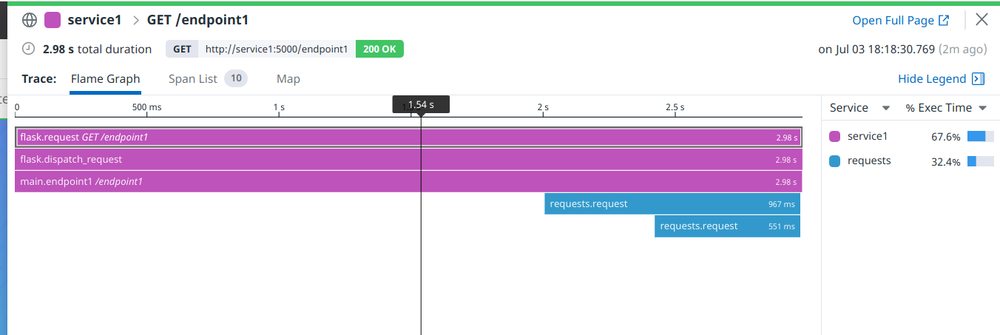
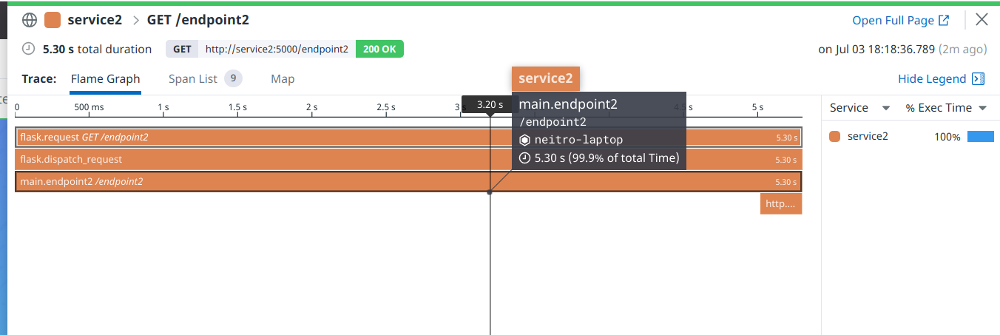

# How to prepare docker-compose.yml

1. Copy docker-compose_template.yml as docker-compose.yml
2. Replace `DD_API_KEY=%DD_API_KEY%` and `DD_SITE=%DD_SITE%` with your datadog API key and site
3. Done!

# How to run check:
1. 
```bash
docker-compose up -d
```
2. Check results in datadog!

# Results:
## Service1 (flask + requests)


## Service2 (flask + httpx)

